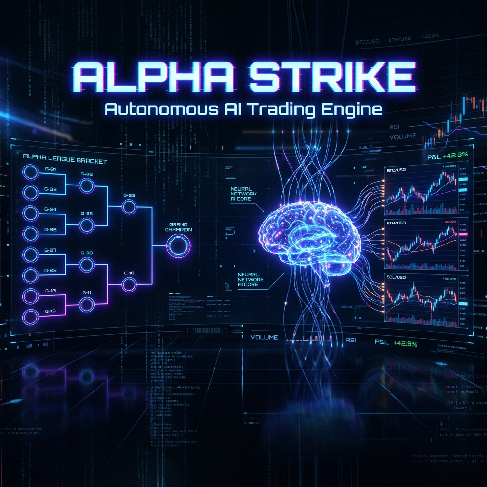

<p align="center">
  
</p>

<h1 align="center">⚡ ALPHA STRIKE</h1>
<h3 align="center">Autonomous AI Trading Engine — 13 Strategies × 6 Pairs × Zero Human Intervention</h3>

<p align="center">
  
  
  
  
  
</p>

<p align="center">
  <b>A self-evolving crypto trading system that breeds, battles, and promotes strategies through a Darwinian tournament —<br/>powered by Gemini AI and a real-time XGBoost ML layer.</b>
</p>

---

## 🧬 What is Alpha Strike?

Alpha Strike is a **fully autonomous trading engine** that runs 13 independent strategies across 6 cryptocurrency pairs simultaneously. Strategies compete in a Darwin-style tournament where only the fittest survive, get promoted from paper to live trading, and continuously evolve through AI-powered self-training.

**No human intervention required.** The system trades, learns, adapts, and evolves 24/7.

```
Paper Trading → Shadow Mode → Live Execution → Capital Scaling
     ↑                                              ↓
     └──── Elimination ← Demotion ← Underperformance
```

## 🏗️ Architecture

```
┌──────────────────────────────────────────────────────┐
│                    ALPHA STRIKE                       │
├──────────────┬───────────────┬────────────────────────┤
│  13 STRATEGIES│  ML LAYER     │  AI BRAIN              │
│  ───────────  │  ──────────   │  ────────              │
│  G-01 Momentum│  Regime Class.│  Gemini 3.1 Pro        │
│  G-02 Scalp   │  EV Predictor │  Tournament Coord.     │
│  G-03 Orderflow│ Vol Predictor│  Self-Trainer           │
│  G-04 MACD    │  39 Features  │  Memory Consolidation   │
│  G-05 Stoch   │  Walk-Forward │  Nightly Reflection     │
│  G-06 BB Sqz  │  XGBoost      │                        │
│  G-07 RSI Div │               │                        │
│  G-08 VWAP    │               │                        │
│  G-09 ATR     │               │                        │
│  G-10 Ichimoku│               │                        │
│  G-11 Liq Hunt│               │                        │
│  G-12 Cross-P │               │                        │
│  G-13 Vol Delt│               │                        │
├──────────────┴───────────────┴────────────────────────┤
│  CORE: Circuit Breaker │ Kelly Sizing │ Risk Manager   │
│  INFRA: FastAPI │ Real-time Dashboard │ Binance WS     │
└──────────────────────────────────────────────────────┘
```

## 🎯 The 13 Gladiators

| ID | Strategy | Style | Edge |
|----|----------|-------|------|
| **G-01** | Momentum Burst | Trend | Catches explosive moves with volume confirmation |
| **G-02** | Scalp Ultra | Scalp | Sub-minute entries with tight risk management |
| **G-03** | Orderflow Imbalance | Flow | Detects buyer/seller aggression via taker volume |
| **G-04** | MACD Scalper | Momentum | Histogram divergence with trend alignment |
| **G-05** | Stochastic Reversal | Mean Reversion | Oversold/overbought bounces at key levels |
| **G-06** | BB Squeeze Turbo | Volatility | Bollinger Band compression breakouts |
| **G-07** | RSI Divergence | Divergence | Price/RSI divergence for reversal detection |
| **G-08** | VWAP Sniper | Institutional | Volume-weighted entries at fair value |
| **G-09** | ATR Breakout | Breakout | Volatility expansion detection |
| **G-10** | Ichimoku Edge | Multi-Signal | Cloud + Tenkan/Kijun cross system |
| **G-11** | Liquidation Hunter Pro | Predatory | Targets liquidation cascade zones |
| **G-12** | Cross-Pair Divergence | Statistical | Inter-pair correlation breakdown trades |
| **G-13** | Volume Delta Sniper | Microstructure | Buy/sell pressure delta signals |

## 🧠 ML Augmentation Layer

Three XGBoost models enhance every trade decision in real-time:

| Model | Purpose | Features | Update |
|-------|---------|----------|--------|
| **Regime Classifier** | Predicts market regime (Trending Up/Down, Ranging, Volatile) | 39 technical + time features | Weekly |
| **EV Predictor** | Expected P&L per strategy × pair combination | Per-strategy historical performance | Weekly |
| **Volatility Predictor** | Adjusts TP/SL dynamically based on predicted volatility | Realized vol + regime context | Weekly |

**Key Design Principles:**
- 🔒 **Zero future leakage** — Features computed strictly from past data
- 📊 **Walk-forward validation** — No look-ahead bias in backtesting
- 🎯 **39-feature pipeline** — Price, momentum, volume, volatility, and time features
- ⚡ **30-second inference cache** — Sub-millisecond prediction serving

## 🏆 Tournament System

```
PAPER MODE (all strategies start here)
    │
    ▼ After 100+ trades, WR > 55%, PF > 1.5, DD < 15%, 7+ days
    │
SHADOW MODE (48h observation, paper trades tracked)
    │
    ▼ Sustained performance
    │
LIVE MODE (5% capital → scales to 50% max)
    │
    ├── Circuit Breaker: Auto-pause at -5% daily loss
    ├── Kelly Sizing: Dynamic position sizing (0.5x–2.0x)
    └── Demotion: Back to paper if performance degrades
```

**Self-Evolution Loop:**
1. 🧬 **Self-Trainer** — AI analyzes every closed trade, adjusts TP/SL/margin within ±2% rails
2. 🧭 **Tournament Coordinator** — Gemini Pro reviews all strategies every 2h, adjusts confidence multipliers
3. 🧠 **Memory System** — 3-tier (short/mid/long) with nightly AI reflection and pattern promotion
4. ⚖️ **Strategy Eliminator** — Auto-pauses strategies at -8% drawdown, eliminates after 3 pauses

## 📊 Real-time Dashboard

7-view web dashboard with live updates every 10 seconds:

- **🏆 Leaderboard** — P&L, win rate, Sharpe, drawdown rankings
- **📈 Strategy Detail** — Per-strategy trade history and signal analysis
- **🗺️ Heatmap** — Pair × strategy performance matrix
- **🔗 Correlation** — Inter-strategy correlation analysis
- **🚀 Pipeline** — Promotion pipeline visualization
- **⚡ Live Monitor** — Real-time live strategy execution
- **🧠 ML Insights** — Regime predictions, EV forecasts, volatility analysis

## 🚀 Quick Start

```bash
# Clone
git clone https://github.com/gastonchevarria/agent-god-2.git
cd agent-god-2

# Configure
cp .env.example .env
# Edit .env with your API keys

# Run locally
pip install -r requirements.txt
uvicorn main:app --host 0.0.0.0 --port 9090

# Deploy to Cloud Run
gcloud run deploy alpha-strike \
  --source . \
  --region us-central1 \
  --memory 2Gi --cpu 2 \
  --min-instances 1 \
  --set-secrets=GEMINI_API_KEY=GEMINI_API_KEY:latest
```

## 🔧 Configuration

All configuration via environment variables (see `.env.example`):

| Variable | Description | Default |
|----------|-------------|---------|
| `GEMINI_API_KEY` | Google Gemini API key | Required |
| `BINANCE_API_KEY` | Binance Futures API key | Required for live |
| `PAIRS` | Trading pairs (comma-separated) | `BTCUSDT,ETHUSDT,...` |
| `MODE` | `paper` or `live` | `paper` |
| `ML_ENABLED` | Enable ML augmentation | `true` |
| `BRAIN_MODEL` | AI model for coordinator | `gemini-3.1-pro-preview` |
| `EXEC_MODEL` | AI model for self-trainer | `gemini-3-flash-preview` |

## 📁 Project Structure

```
alpha-strike/
├── strategies/          # 13 trading strategies (G-01 to G-13)
│   ├── base_strategy_v4.py    # Base class with ML integration
│   ├── g01_momentum_burst.py
│   └── ...
├── ml/                  # Machine Learning layer
│   ├── features.py           # 39-feature extraction
│   ├── regime_classifier.py  # Market regime prediction
│   ├── ev_model.py           # Expected value per strategy
│   ├── volatility_predictor.py
│   ├── inference.py          # Cached runtime API
│   └── training_pipeline.py  # Weekly retraining
├── core/                # Engine components
│   ├── ai_client.py          # Gemini API wrapper
│   ├── circuit_breaker.py    # Risk protection
│   ├── promotion_manager.py  # Paper → Shadow → Live
│   ├── self_trainer.py       # Per-trade AI analysis
│   ├── tournament_coordinator.py
│   └── memory_tiers.py       # 3-tier AI memory
├── scheduler/           # Tournament orchestrator
├── static/              # Real-time dashboard
├── config/              # Settings & env management
└── tests/               # Unit & integration tests
```

## ⚠️ Disclaimer

This software is for **educational and research purposes only**. Cryptocurrency trading involves substantial risk of loss. Past performance does not guarantee future results. The authors are not responsible for any financial losses incurred through the use of this software.

---

<p align="center">
  <b>Built with ⚡ by <a href="https://github.com/gastonchevarria">@gastonchevarria</a></b><br/>
  <sub>Powered by Gemini AI • XGBoost • Binance Futures</sub>
</p>
